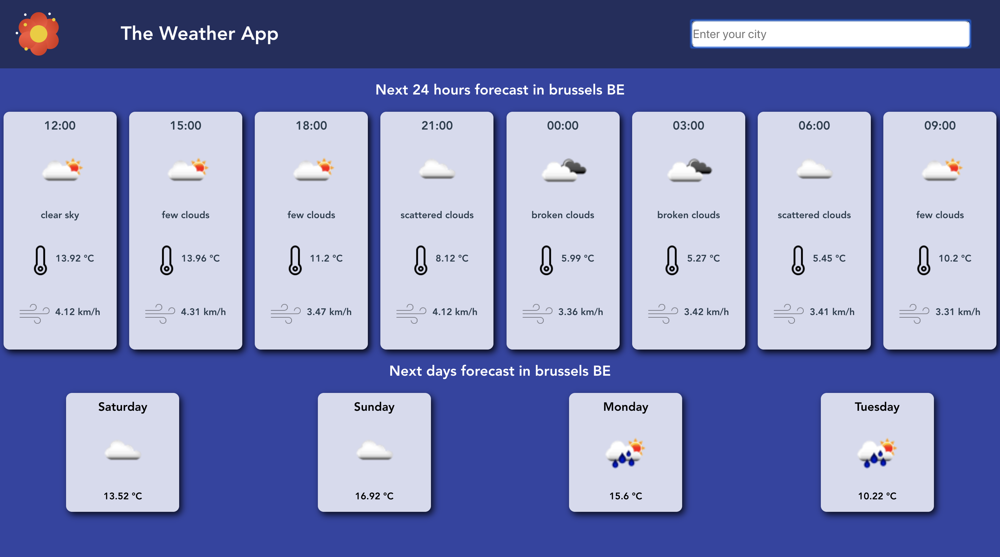

# Weather Application

## Group project of [Broutin Jean-Marc](https://github.com/jmbroutin), [Weiss Dorothee](https://github.com/doropro).

*Exercice realized from 1st april 2019 to 5 april 2019, as a group project for the formation [BeCode](https://www.becode.org/) to be a Web Developper*

## Project

For this project, we have to realize a weather forecast web application using Figma, VueJS and the API openweathermap.

### Link to the complete instructions
https://github.com/becodeorg/BXL-Johnson-3.9/tree/master/Projets/Mets-Tes-Hauts

## Used Languages and technologies

* HTML5, CSS3
* Javascript, VueJS
* Axios, GSAP

## link to the design layout made with Figma
https://www.figma.com/proto/graygCwdmxKZzfBjbrEDOuZ4/WeatherApp?node-id=3%3A0&scaling=min-zoom

## Screenshot

* Try the game! :
	* [Our first cookie clicker](https://fesouille.github.io/Cookies-clicker/)

* A few illustrating pictures:

* Progress: 
	* 07 february 2019: project beginning. In order to achieve this project in group, we made use of [Trello](https://trello.com/) as our Kanban tool.
	* 14 janvier 2019: project end

